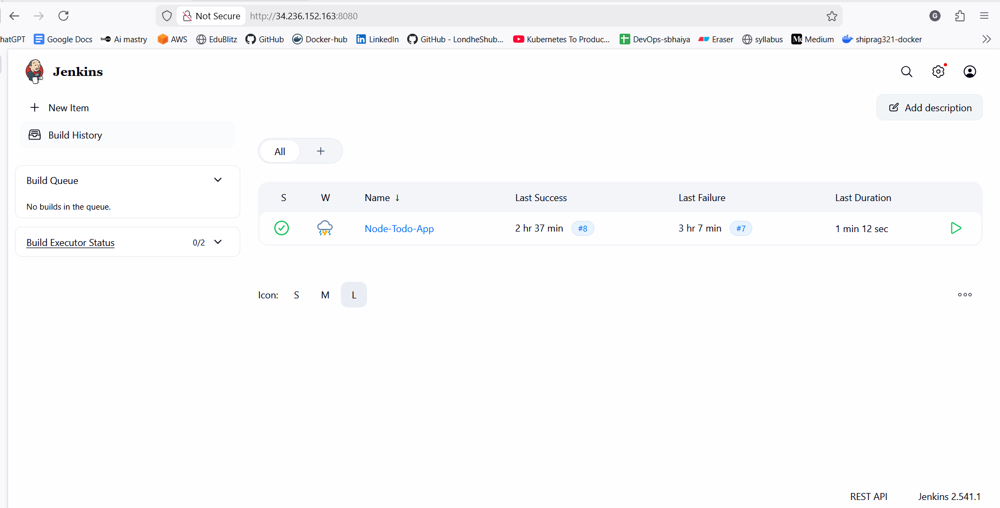
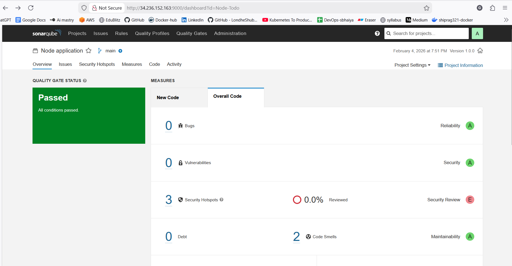
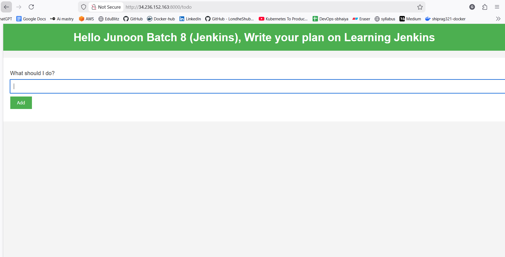

# Node Todo App – CI/CD DevSecOps Project

This project demonstrates an **end-to-end CI/CD DevSecOps pipeline** for a Node.js application using **Jenkins, Docker, SonarQube, Trivy**.

---

## Project Overview

The goal of this project is to automate the **build, security scan, containerization, and deployment** of a Node.js Todo application using industry-standard DevOps tools.

The pipeline covers:

* Code checkout
* Dependency installation
* Static code analysis (SAST)
* Container image build
* Container security scanning
* Application deployment

---

## Tools & Technologies Used

| Category         | Tools                          |
| ---------------- | ------------------------------ |
| Language         | Node.js                        |
| CI/CD            | Jenkins (Declarative Pipeline) |
| Code Quality     | SonarQube                      |
| Containerization | Docker, Docker Compose         |
| Image Security   | Trivy                          |
| SCM              | Git, GitHub                    |
| OS               | Linux (Ubuntu/Amazon Linux)    |

---

## Project Structure

```
node-todo-cicd/
├── Dockerfile
├── docker-compose.yml
├── Jenkinsfile
├── package.json
├── package-lock.json
├── app.js
├── routes/
├── views/
├── sonar-project.properties
└── README.md
```

---

## CI/CD Pipeline Flow

### 1️⃣ Code Checkout

* Jenkins pulls source code from the GitHub repository

### 2️⃣ Install Dependencies

* Uses `npm install` to install Node.js dependencies

### 3️⃣ SonarQube Analysis (SAST)

* Static code analysis for:

  * Bugs
  * Code smells
  * Security vulnerabilities
* Generates a quality report on the SonarQube dashboard

### 4️⃣ Docker Image Build

* Builds Docker image using Dockerfile

### 5️⃣ Trivy Image Scan

* Scans Docker image for OS & library vulnerabilities

### 6️⃣ Application Deployment

* Deploys the application using Docker Compose







---

## Jenkins Pipeline

```text
Checkout Code → Install Dependencies → SonarQube Scan → Docker Build → Trivy Scan → Deploy
```

---

## Security Practices Implemented

* **SAST**: SonarQube for static code analysis
* **Container Security**: Trivy for Docker image scanning
* **Shift-Left Security** approach in CI/CD pipeline

---

## How to Run Locally

```bash
# Clone repository
git clone https://github.com/LondheShubham153/node-todo-cicd.git

# Install dependencies
npm install

# Run app
npm start
```

---

## Docker Commands

```bash
# Build image
docker build -t node-todo-app .

# Run using docker-compose
docker-compose up -d
```

---

## Challenges Faced & Learnings
While building this end-to-end Jenkins CI/CD DevSecOps pipeline, I encountered multiple real-world issues. Solving these helped me gain practical troubleshooting and debugging experience similar to production environments.

### 1️⃣ Trivy Installation – Version & 404 Error
- Issue: Trivy download failed with 404 Not Found when using the latest URL with an older version.
- Root Cause: GitHub releases were updated, and the referenced version no longer existed under latest.
- Learning:
   - Always verify tool versions before downloading
   - Prefer package managers (apt) or correct release tags

### 2️⃣ Docker Permission Denied in Jenkins
- Issue: Docker build failed with permission denied while trying to connect to the Docker daemon.
- Root Cause: Jenkins user did not have permission to access Docker socket.
- Learning:
   - Jenkins requires explicit Docker permissions
   - User must be added to the docker group

### 3️⃣ Docker Build Context Error (.git Folder)
- Issue: Docker build failed while trying to add .git directory to build context.
- Root Cause: Missing .dockerignore file.
- Learning:
   - Always exclude unnecessary files using .dockerignore
   - Reduces build size and prevents permission issues

### 4️⃣  Downstream Stages Skipped (Trivy & Deploy)
- Issue: Trivy scan and deployment stages were skipped automatically.
- Root Cause: Jenkins declarative pipeline stops downstream stages after failures.
- Learning:
   - CI/CD pipelines are sequential
   - One failing stage can block deployment

### Key Takeaway
This project exposed me to real-world DevOps and DevSecOps challenges such as tool compatibility, Jenkins plugin behavior, Docker permissions, and external security service limitations. Debugging these issues strengthened my understanding of how production CI/CD pipelines are designed and maintained.

---

## Learning Outcomes

* Practical CI/CD pipeline creation
* Jenkins declarative pipelines
* Secure DevOps practices (DevSecOps)
* Docker & container security
* Real-world troubleshooting of CI/CD issues

---

## Future Improvements

* Add Kubernetes deployment
* Integrate NVD API key for Dependency-Check
* Add Slack/Email notifications
* Implement Jenkins shared libraries
